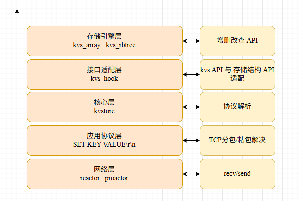

# 基于C语言的简易KV存储实现

1.  网络层提供了 `reactor` 和 `iouring` 两种模式；
2.  存储引擎提供了基于 `kvsarray` 和 `kvsrbtree` 的两种实现
3.  提供了解决 `TCP` 分包/粘包的模式

可以通过在 `kvstore.h` 中进行上述三种模式的组合。

**编译与运行:**

```c
mkdir build/
cd build/
cmake ..
make
./kvs 8888

```

**测试案例：**

```c
cd testcase/
gcc -o testcase testcase.c
./testcase 127.0.0.1 8888

```


**分层模型图示：**



**TCP 分包/粘包解决思路图示:**

**reactor:**


**iouring:**


